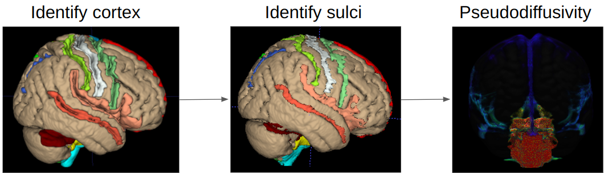

# CSF-based spatial statistics



## Installation
* prerequisites
    - Linux system
    - python3
    - [python3 virtual environment](https://tellor.io/blog/how-to-install-python-3-9-and-venv-on-ubuntu/)
    - [gfortran](https://fortran-lang.org/learn/os_setup/install_gfortran/)
    - [lapack](https://askubuntu.com/questions/623578/installing-blas-and-lapack-packages)
    - [FSL](https://fsl.fmrib.ox.ac.uk/fsl/fslwiki/FslInstallation)
    - [freesurfer](https://surfer.nmr.mgh.harvard.edu/fswiki/DownloadAndInstall)
    - R (optional)

* NB: gfortran and lapack may be already installed in your system. Check:
```bash
gfortran --version  # check if gfortran exists
apt-cache policy liblapack3  # check if lapack exists
```

* After installing all the packages above
```bash
git clone https://github.com/Yutong441/CBSS
make
# If the installation is successful,
# you will see a file called `fort.cpython*.so` in the `CBSS/src` folder
# and the python virtual environment will be in `software/cbss_venv`
# The installation should take around 5 minutes
```
 
* R environment:
    - This is only needed for statistics at the end
    - It is not required for running CBSS
    - need 2 packages: `data.table` and `tidyverse`

## Usage
* data requirement
    - DTI: image, bvec and bval
    - IVIM: image and bval
    - fMRI: optional
    - ASL: optional

* folder structure
    - Store all the images in one location (I will refer to this location as `data_dir`).
    - This diectory must contain two folders: `original` and `processed`
    - The `original` folder has one folder for one patient
    - The `processed` folder stores CBSS results
    - NB: only accept ".nii.gz" files, ".nii" files are not accepted (unless you
    modify the `CBSS/data_regex.json` file)
    - For examples,

```
├── original
│   ├── ID1
│   │   ├── ASL.nii.gz
│   │   ├── DTI.bval
│   │   ├── DTI.bvec
│   │   ├── DTI.nii.gz
│   │   ├── fMRI.json
│   │   ├── fMRI.nii.gz
│   │   ├── IVIM.bval
│   │   └── IVIM.nii.gz
│   └── ID2
└── processed
```

```bash
source software/cbss_venv/bin/activate
python CBSS/pipeline.py --root=$data_dir
```

If you have fMRI and ASL data, you may obtain regional CBF, ALFF, CVR and
neurovascular coupling statistics by running:
```bash
python CBSS/neurovasc.py --root=$data_dir
```

## Output
* key output files
    - All outputs will be found in the `${data_dir}/processed` folder
    - pseudodiffusivity in each sulcus:
    `CBSS/stats/sum_stats/sum_stat_sulcus.csv`
    - pseudodiffusivity in each ventricle:
    `CBSS/stats/sum_stats/sum_stat_vent.csv`
    - pseudodiffusivity in each ventricle subregion:
    `CBSS/stats/sum_stats/sum_stat_region.csv`

* optional output files
    - CBF in each gyrus: `CBSS/blood_stats/stats_sulcus_CBF.csv`
    - ALFF in each gyrus: `CBSS/blood_stats/stats_sulcus_ALFF.csv`
    - CVR in each gyrus: `CBSS/blood_stats/stats_sulcus_CVR.csv`
    - neurovascular coupling in each gyrus:
    `CBSS/blood_stats/stats_sulcus_NVC.csv`

## Statistics
* summarize the pseudodiffusivity data:
    - `save_dir`: where to save the files
    - I recommend running the following file via commandline rather than Rstudio

```bash
Rscript stats/sum_data.R $data_dir $save_dir
```

* output in `$save_dir`
    - `all_diff.csv`: pseudodiffusivity data, where one row is the
    pseudodiffusivity of one region in one patient
    - `all_perf.csv`: similar to `all_diff.csv`, fMRI and ASL-related metrics
    - `global_perf.csv`: global fMRI and ASL-related metrics

* analysis: see the `stats/CBSS_cog.R` file for an example

## Atlas
You may find the CSF parcellation atlas here: `data/sulcus_vent.nii.gz`. This is
useful for plotting.

The gyrus is also labelled with the sulcus it is closest to:
`data/sulcus_corr.nii.gz` and the labels have been manually corrected by an
experienced radiologist. This is used for the atlas registration in CBSS.

The name of each label is stored in: `data/CBSS_atlas.csv`.
